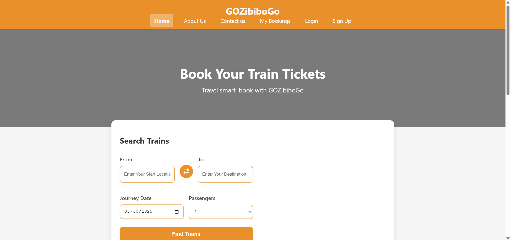
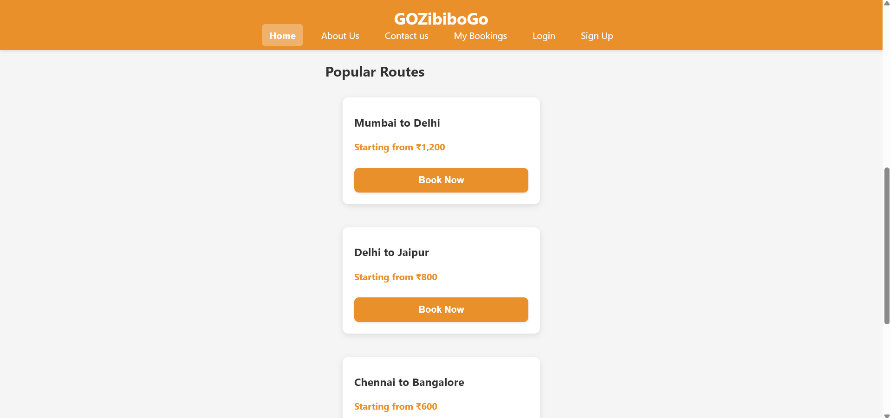
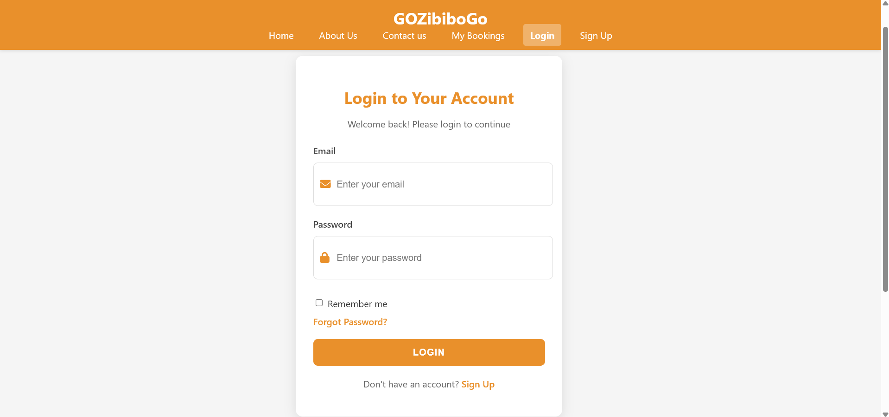
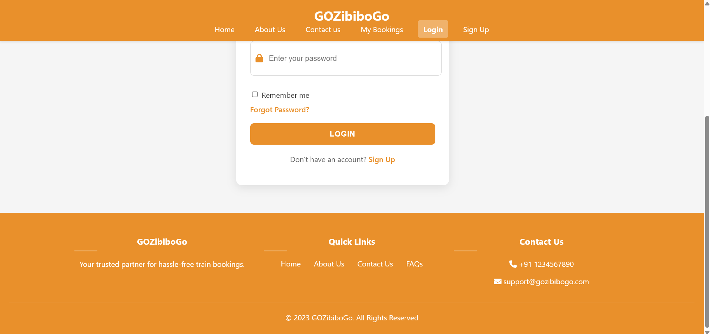
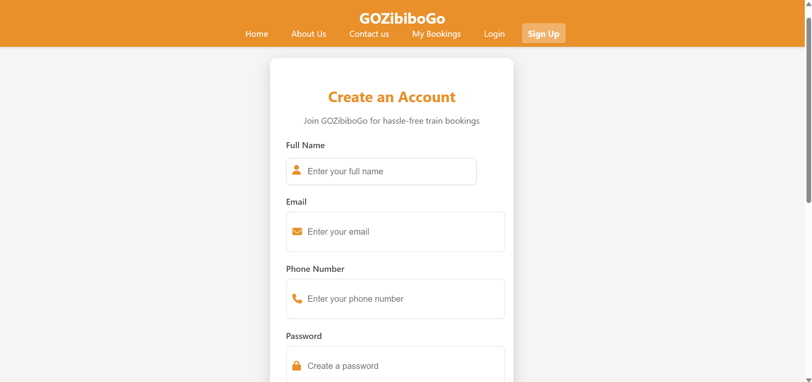
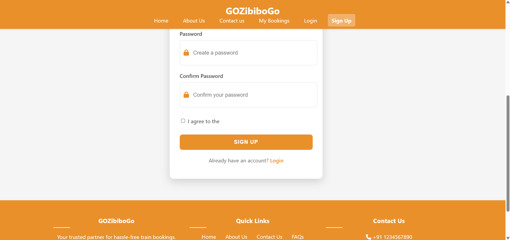

# GOZibiboGo - Train Ticket Booking Platform

A modern, user-friendly train ticket booking platform that allows travelers to search, book, and manage their train journeys seamlessly.

## 📋 Features

- **User-friendly Interface**: Clean and responsive design for seamless booking experience
- **Train Search**: Search trains between stations with flexible date options
- **Popular Routes**: Quick access to booking on frequently traveled routes
- **User Authentication**: Secure login and signup functionality
- **Booking Management**: View and manage your bookings
- **Responsive Design**: Works perfectly on all devices - desktop, tablet, and mobile

## 🛠️ Technologies Used

- **Frontend**:
  - HTML5
  - CSS3
  - JavaScript
  - Font Awesome Icons

## 🚀 Pages

1. **Home Page**: Search trains, view popular routes
2. **Login Page**: User authentication
3. **Sign Up Page**: New user registration
4. **About Us**: Information about GOZibiboGo
5. **Contact Us**: Get in touch with the team
6. **My Bookings**: Manage booked tickets

## 🖥️ Screenshots

- **Home Page**







- **Login Page**







- **Signup Page**







## 🚂 Getting Started

### Prerequisites

- A modern web browser (Chrome, Firefox, Safari, Edge)

### Installation

1. Clone the repository
   ```
   git clone https://github.com/sadankshgangrade/GOZibiboGo.git
   ```
2. Open `index.html` in your browser to start using the application

## 🔄 Workflow

1. Users search for trains by entering source, destination, date, and passenger count
2. Select from available trains
3. Complete the booking process
4. Manage bookings through the 'My Bookings' section

## 💻 Development

To contribute to this project:

1. Fork the repository
2. Create a feature branch
   ```
   git checkout -b feature/YourFeature
   ```
3. Commit your changes
   ```
   git commit -m 'Add some feature'
   ```
4. Push to the branch
   ```
   git push origin feature/YourFeature
   ```
5. Open a Pull Request

## 📝 Future Enhancements

- Payment gateway integration
- Real-time train status updates
- Seat selection functionality
- User reviews and ratings
- Mobile app development

## 👤 Author

**Sadanksh Gangrade**

- GitHub: [Sadanksh Gangrade](https://github.com/SADANKSH)

## 🙏 Acknowledgements

- Font Awesome for the icons
- All contributors who have helped make this project better 